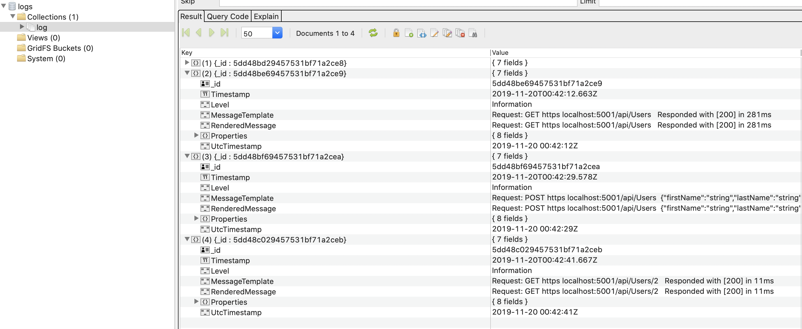
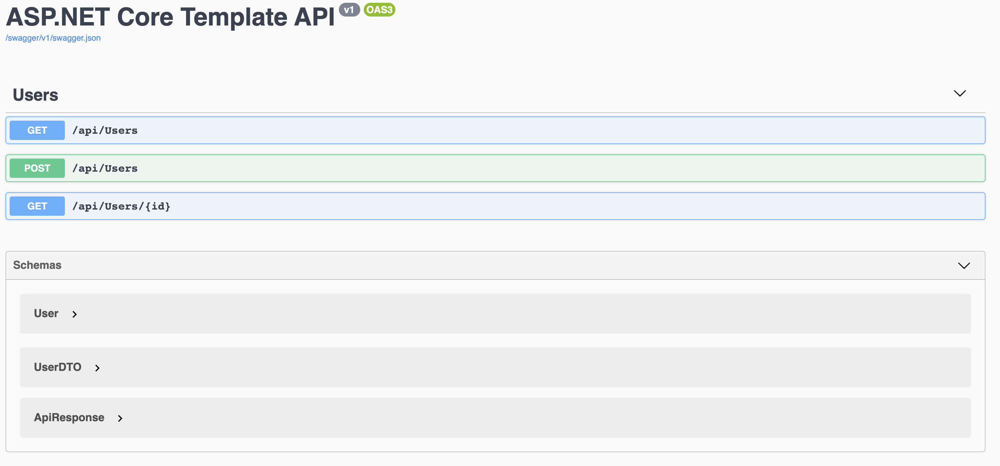

# .NET Core Web API Starter Template

## Table of contents
* [General info](#general-info)
* [Technologies](#technologies)
* [Architecture](#architecture)
* [Setup](#setup)
* [MongoDB](#mongodb)
* [Test API](#test-api)

## General info
This project is intended to provide core functionality for a .NET Core Web API using sound (albeit opinionated) architecture and popular NuGet packages used in modern .NET Core API development.
	
## Technologies
Project is created with:
* .NET Core 3.0 (based on [ApiBolierPlate](https://github.com/proudmonkey/ApiBoilerPlate))
* AutoWrapper
* AutoMapper
* FluentValidation
* Scrutor
* Serilog
* Swashbuckle

## Architecture
This starter template follows the onion architecture, although it is opionated in structure.

The onion architecture promotes loose coupling and abstracting between domain, business, and service layers.

From the API, the hierarchy is as follows:

API --> Service --> Repository --> Domain

We can describe the advantage of this architecture by spelling out the hierarchy from bottom up:

> Domain objects represent the database objects.

>The Repository layer has intimate knowledge of the objects and the data access rules necessary to translate the objects from the underlying data source.

>The Service layer interacts with the Repository layer (via interfaces) to perform business logic on the data to then present upward.  The Service layer may also call other services (via interfaces).

>The API Controllers serve as the Infrastructure layer, and generally call the Service layer (via interfaces).  The API Controllers can call the Repository layer (via interfaces) but this is only if there is little to no business logic applied.  General rule of thumb is to keep controller logic as light as possible... handle request, prepare response and status code.

For more information on the onion architecture, see [Understanding Onion Architecture](https://www.codeguru.com/csharp/csharp/cs_misc/designtechniques/understanding-onion-architecture.html)
	
## Setup
Build the template on your local machine, from the root project

```
$ dotnet new -i .
```

The template is installed with shortname 'vbswebapi'

Now you can create your own project with your own namespace

```
$ dotnet new vbswebapi --help
```

```
VandenBrink Software Starter Web (C#)
Author: Steve VandenBrink
Options:                                                                              
  -ns|--namespace  The namespace to use for all source files generated by the template
                   string - Required                                                  
                   Default: API   


  -us|--useMongoDB  Sets up MongoDB with structered logging and boilerplate
                    bool - Optional
                    Default: false / (*) true
```

For example, if you want to create a new project with the RootNamepace as 'MyProject', run the following

```
$ dotnet new vbswebapi -n MyProject -ns MyProject
```

Then navigate to the MyProject folder created, inspect the code, and now all files are prefixed with the given namespace.

For example, Startup.cs in the API project is in namespace MyProject.API.

Make sure that after the project is created you perform:

```
$ dotnet restore
```

## MongoDB

If you want to create a project that contains infrastructure for MongoDB, both for the backing data store AND structured logging, then use the --useMongoDB flag.

Example

```
$ dotnet new vbswebapi -n MyProject -ns MyCompany --useMongoDB
```

Example of Structured Logging in logs collection:



Take a look at the different appsettings which now have boilerplate for MongoDBSettings:

```json
"MongoDBSettings": {
    "ApplicationName": "your-app-name",
    "Server": "localhost",
    "Port": "27017",
    "Timeout": 120,
    "Admin": "",
    "Password": ""
  }
```

If you replace your-app-name with your own application name, i.e. MyApplication, then when you have repositories that extend MongoRepositoryBase and you write to collections... your local mongo instance will have a Database named MyApplication.

Entities in Domain/Mongo should extend MongoIdentity, and have a [MongoDocument()] attribute applied to the class.

In the concrete repository, there are Extension methods for IMongoDatabase that will use the attribute on generic class T, so that you don't have to specify the collection name.

## Test API

Run the project

```
$ dotnet run
```

Open a web browser at localhost:5000/swagger



### Get Users

Try out and execute GET /api/Users

You will get a 200 response with 1 user returned

### POST New User

Try out and execute POST /api/Users

Update the request JSON body to your liking.

You will get a 200 response with 1 user returned including a dummy ID that the server might generate from the backing database.

Additionally, try empty strings or deleting properties in the JSON body entirely.  You will get a 400 type response with a list of validation errors (this is FluentValidation at work!).

### GET Specifc User

Try out and execute GET /api/Users/{id}

You will get a 200 response with the desired user returned with that id.